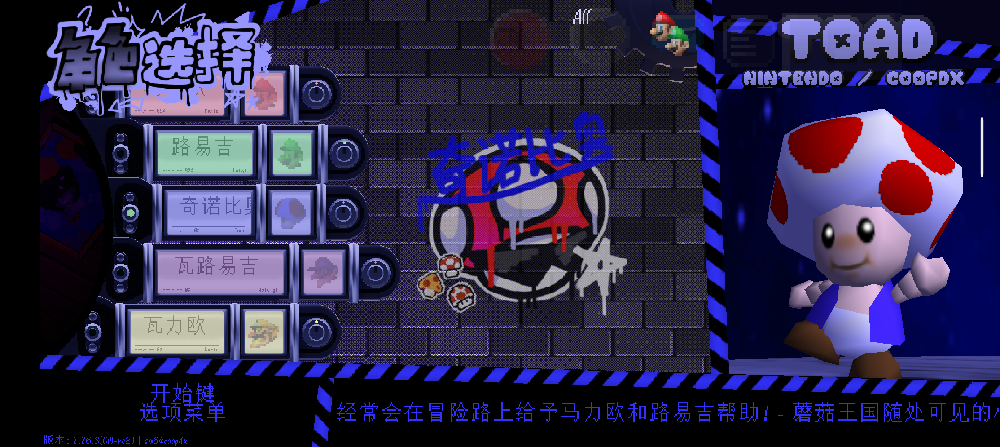

CoopDX 初期开发前后出现的一个库，由 Squishy6094 牵头开发。此依赖库提供了完整的、便捷的将马里奥替换成别的模型的 API，并提供扩展功能例如扩展动作集、自定义声线、HP面板纹理等。同时提供一个方便的选择菜单以便玩家快速切换  
现在大部分的角色模组都要求依赖 Character Select。

## 特性
 - 精美且直观的选择界面
 - 完整的全套 API 添加角色支持
 - 可直接使用的模板
 - 自定义程度高（包括声线、生命图标、HP值面板、动作集、模型本体的自定义动画等）
 - 可对人物分门别类

## 截图

*（v1.16.2 CN-rc3 开发时截图）*

## 汉化历史
 - 最早期的汉化版本为 v1.12.2，由 xiao-Link 汉化
 - 但因为由于进程太慢，此时已经 v1.14.1 版本，Shangshanruo 完成了旧版字符串汉化的移植*（其实我也有我本人移植的 v1.14.1 汉化，但后来把这机会给 Shangshanruo 了）*
 - 版本 v1.15.1 由我本人移植汉化
 - v1.16 开始，界面被直接大改了，但需要 DX1.4 版本。很可惜因为新版触控拉完了，导致更新被拉迟。同时我也在完成我本人的 Namefix 修复，此部分详细请：我还没写
 - 26年5月，Shangshanruo 完成了 1.4.1 更新并移植了旧版触控。终于可以开始进行 v1.16.1 的汉化了
 - v1.16.1 版本的汉化最开始也只有我主持，但之后 SLG5 和 不正常的Noise 为本版本的内置/默认涂鸦和Logo提供了贴图汉化支持
 - 26年7月底，v1.16.1 CN-rc3 合并了 Namefix 的特性，并成功内置在 DX1.5.1 (汉化1.0.1) 版本