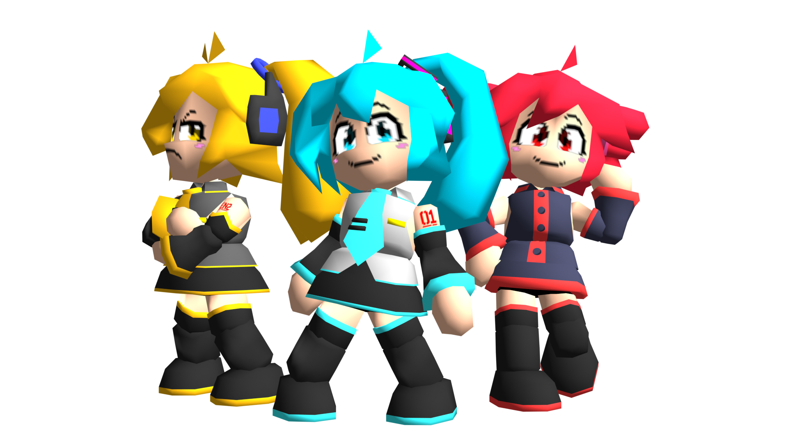

经典款术力口模组包，初音未来、重音 Teto 和亚北音留，来到蘑菇王国 -- 低多边形世界探索、发现和击败浏览器！

## 可用角色
 - 一个初音未来
 - 一个重音 Teto
 - 一个亚北音留

至于为什么是这三个，以及标题使用 Triple Baka，参考 [BV1NV4y1w7XV](https://www.bilibili.com/video/BV1NV4y1w7XV)

## 其他特性
 - P主特制！（（（bushi 三个人都有自己的音色库
 - 特制帽子状态
 - 特制帽子音乐
 - 特制动作
 - 三个人也有对应的扩展模型
 - 允许使用自定义调色板重新调色
 - So Retro! 模组支持
 - 自定义的结束场景音乐和贴图
 - 汉化特供涂鸦支持！
 
此模组连续更新两年了，现在也算是在角色模组的第一梯队了说是

## 汉化历程

 - 首次汉化发起于 toadXtech64 和（我也忘记谁了）一起翻译，主要以 toadXtech64 汉化和名称支持，另外一位则为此提供译文
 - 后续 v1.16 角色选择时代有 Red\_Mario 和不正常的Noise 提供了涂鸦汉化，在此也非常感谢两位贡献

<modNavbox />