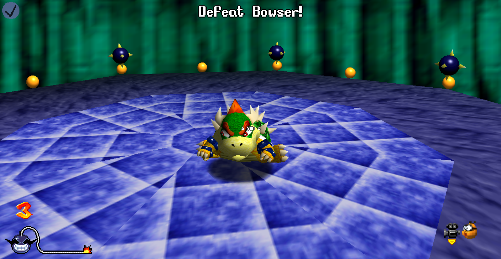
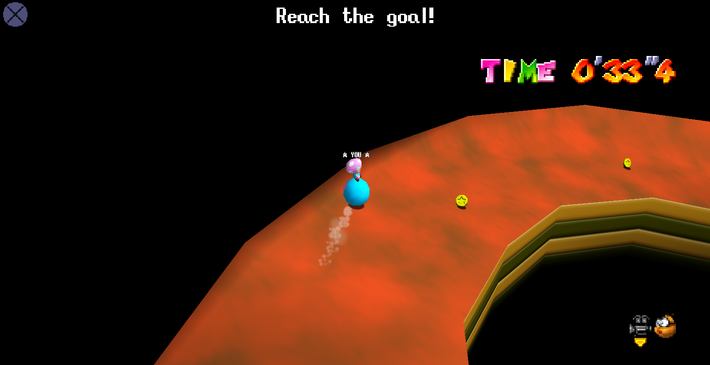

<table>
  <tr><td colspan="2">

</td></tr>
  <tr>
    <td>模组名</td>
    <td>CoopWare</td>
  </tr>
  <tr>
    <td>别称</td>
    <td>Coop 制造</td>
  </tr>
  <tr>
    <td>模组类型</td>
    <td>游戏模式</td>
  </tr>
  <tr>
    <td>作者</td>
    <td>EmilyEmmi 设计灵感: someguylostontheinternet, majorstuff, LJ_RETRO, demolm_, ColeSpeedruns RNG 实现: Blocky 贴图设计: DogToon64, KrystalPhantasm, C. Pariah</td>
  </tr>
  <tr>
    <td>汉化</td>
    <td>toadXtech64 (Toad114514)</td>
  </tr>
  <tr>
    <td>Lua 文件</td>
    <td>无预编译/加密</td>
  </tr>
  <tr>
    <td>最新版本</td>
    <td><b>v1.2</b></td>
  </tr>
  <tr>
    <td>下载链接</td>
    <td><a href="https://mods.sm64coopdx.com/mods/coopware.993">Coopdx 模组站 (原版)</a> 我的合集链接 (汉化)</td>
  </tr>
</table>
受瓦力欧制造系列游戏的启发，EmilyEmmi 最新力作。支持多人联机合作/对抗和团队对抗，17+4 个小游戏。你作为玩家要在规定时间内完成一系列任务，活到最后赢得胜利
## 特性
  - 支持多人联机 (合作/对抗/团队比拼)
  - 无尽模式
  - 小游戏练习模式
  - 17 个小游戏和 4 个Boss环节挑战游戏
  - 高度自由的游戏模式自定义
  - 小型成就系统
  - 旁观系统
  - 神作UI菜单
  - 高度自由的API (支持添加自定义成就/小游戏)
## 玩法
在普通游戏中，你作为玩家要在一系列的小游戏中完成任务，任务完成将继续下一个小游戏，任务失败扣除一滴血。所有生命丢掉了游戏就结束了，玩过瓦力欧制造系列游戏的会很熟悉这种玩法  
在默认配置下，玩家默认会有四条命，每5个小游戏加快 0.1 倍，每15个小游戏就会有 Boss 环节，同时 Boss 环节之后会提升难度。
## 截图

## 玩家模式
这些玩家模式无论在经典/沙盒还是扩展都需要让你选择其中之一
### Coop / 合作
此模式下所有玩家将互相合作完成小游戏，让所有人都坚持下去，高分记录所有人都将共享。
### Versus / 对抗
此模式下所有玩家成为彼此之间的敌人，每个人都需要尽量完成自己的任务，坚持到最后的玩家赢得这场游戏的胜利。高分榜记录每个人自己独有。
### Team Versus / 团队比拼
此模式下玩家将分成不同的队伍，每个人都要保证让自己的队伍活到最后，属于是前面两个的合体。活到最后的队伍获胜，其高分记录也会与获胜队伍里的所有玩家共享。  
值得注意的是此模式下主机可以设置分配方案：  

 - Player Only (玩家自定)：每位玩家都可自由选择自己的队伍
 - Host Only (仅房主)：队伍分配仅由房主决定*（不建议使用，这样会导致游戏不公平而且房主分不好还容易挨骂）*
 - Random (随机)：队伍完全随机分配
 - 1 vs All (一人vs所有)：挑选其中一个玩家自成队伍，所有人一起跟这个人对打*（猎人游戏是吧）*
## 小游戏
以下这些小游戏在默认游戏中会随机出现，任务多种多样，在限时时间内未完成任务就会扣除一条命。你也可以通过 Sandbox (沙盒) 来专门训练某一项小游戏
### So Long!!!
在此小游戏中，你将来到神秘库巴王的老窝，你需要击败库巴王。抓住他们的尾巴丢向炸弹吧。时间紧迫得快点丢！
### Which Cap?
你的面前有很多箱子，根据提示找到 Wing/Metal/Vanish Cap 的箱子然后拿到他的帽子，玩家变身后就完成任务了。  
**注意：玩家拿到帽子之后才能完成任务，所以在这建议使用坐莲顶箱子，可以保证更快的获取帽子**
### Platformer
你将会被固定传送到 Rainbow Road。考察你的 3D 平台跳跃能力！通过一些简单的跳跃，拿到星星就完成了。记得不要掉下去！
### Through The Fire and Flames
这次在熔岩关卡上的平台，四面八方都有神秘火焰来袭，你要做的是在限时时间内躲过这些火焰不要被烫到！在该小游戏下你不能通过跳跃来躲避这些火焰。  

!!! tips "Tips:"
    在难度1下，由于少量的火焰，有时你可以站着不动躺赢

### Red Coin Hunt
你将作为马里奥到神秘黄色毛毛虫家里，它说它下面地方太多红币了，你需要去帮他清理一下。收集一定的红币数量就完成了，可注意不要掉下去了

 - 难度1 需要2颗
 - 难度2 需要4颗
 - 难度3 需要5颗
### Volley Well
你和栗宝宝打排球，你需要接住对面所传来的所有球，用身体去碰/打/踢都可以。  
如果没接中任务就失败了*（我目前没见到排球落地反弹还能接住的，可能这是特性）*
### Choose Your Fighter

!!! warning "依赖"
    此小游戏需要依赖角色选择模组，如果服务器未启用角色选择模组，那么此小游戏默认为禁用状态

在限时时间内快速选择要求更换的角色，不仅考验眼力还要考验你的手速！在难度三下甚至会要求你选择两个角色。

- 难度1 选择1种角色
- 难度2 同1，需要角色会离开始焦点更远
- 难度3 需选择2种角色，选完一个选下一个

!!! tips "小技巧"
    使用角色选择 1.16 及更高版本，可以使用网格视图（按X切换）快速查询需要的角色！这个方法唯一问题是可能会看眼花了不知道在哪里

### Logs and Pound
在你的四个角落都有一些木头，用任何方式去将这些木头打到地底下（主要用坐莲多点）。限时时间内完成！

- 难度1 一段木头（只需一次坐莲）
- 难度2 两段木头（两次坐莲）
- 难度3 三段木头（三次坐莲）
### 6400 IQ Super Quiz
经常在电视上看到的问答环节，现在在这里我们也有问答！6400 IQ 智商大挑战！观察上面的题目，站在正确的选项对应位置来决定你的答案，答错了后果你懂的。

- 难度1 常识题（什么动物有4条腿、哪些东西是食物等）
- 难度2 SM64知识题（马里奥最大生命值是多少、关卡在城堡第几层等）
- 难度3 当前状态拷问（这是第几个小游戏、你有多少条命等）
### Cannon Event
成为中国机长吧。你将成为炮弹，向要求的地方发射，完成任务！就这么简单。

- 难度1 射向那堵墙*（这里指WF墙内星星的墙，通过大炮打碎即可，打碎左边的墙也可完成任务）*
- 难度2 射向小岛
- 难度3 同上，只不过换成了BOB的小岛
### Say The Line!
扣字环节，限定时间内在聊天框输入要求的字符串即可！不区分大小写

- 难度1 单词/网络常用缩写*（主要是欧美的）*
- 难度2 更长的单词/缩写
- 难度3 句子

!!! tips "提示"
    手机端玩家的词库与电脑端不同，考虑到屏幕特殊性，手机端玩家词库通常比电脑端更短。

### Bumper Balls
你将站在球上滚动，保持你的平衡，不要从平台掉下去！影响因素包括四面八方来的风和多人游戏下的敌人

- 难度1 仅一个方向的风
- 难度2 吹两次风
- 难度3 吹三次风，且第三次会转到第二次反方向再吹一次

**..其他游戏待补..**
## Boss 环节
Boss 环节通常会在游戏流程更久的时候出现，当你赢得了 Boss 战之后你将会获得一条命（当然到达上限了不会加），这些 Boss 战通常需要花费更久的时间来完成  
**..小游戏待补充..**