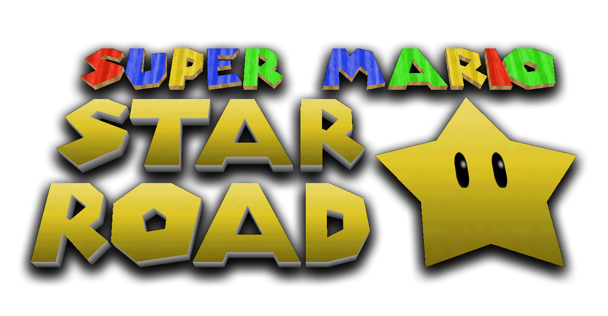
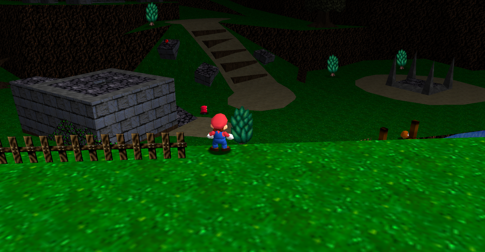
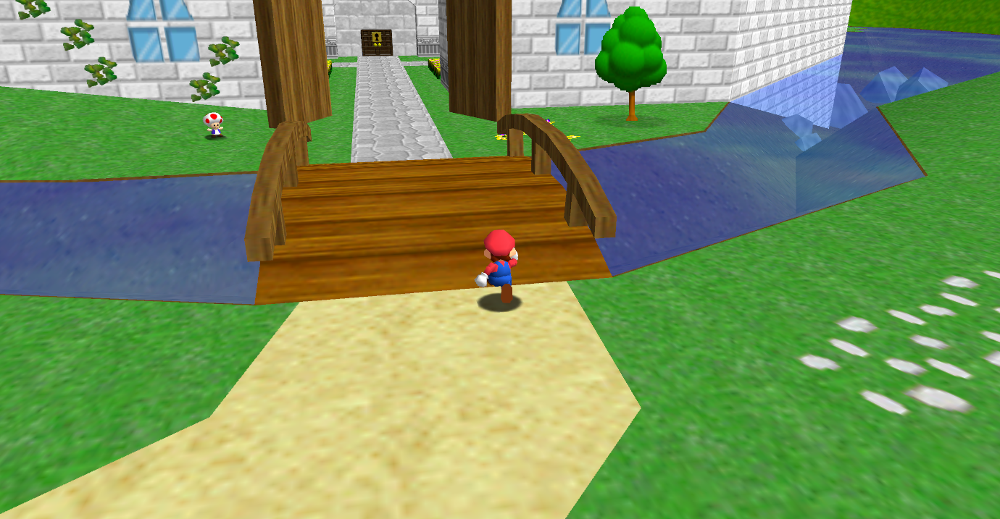
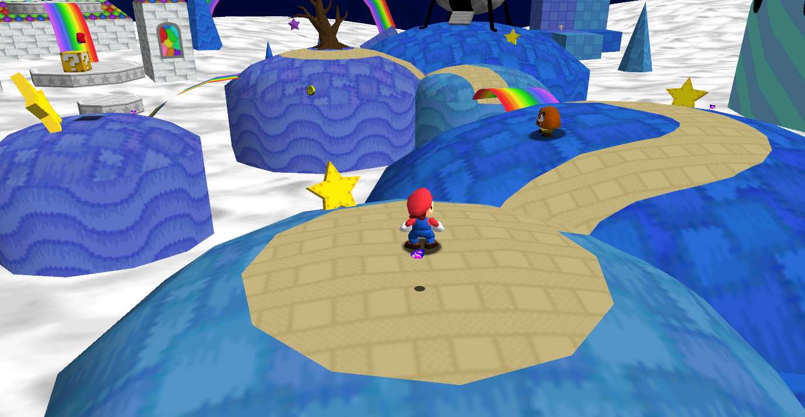

# Super Mario Star Road
<table>
  <tr><td colspan="2">

</td></tr>
  <tr>
    <td>模组名</td>
    <td>Star Road</td>
  </tr>
  <tr>
    <td>模组类型</td>
    <td>Romhack</td>
  </tr>
  <tr>
    <td>Romhack 作者</td>
    <td>Skelux</td>
  </tr>
  <tr>
    <td>Romhack 信息</td>
    <td><b>130颗星 15个场景 2011.12.24发布</b></td>
  </tr>
  <tr>
    <td>移植</td>
    <td>忘名字了</td>
  </tr>
  <tr>
    <td>下载链接</td>
    <td style="color: green">[Coopdx自带]</td>
  </tr>
</table>

Star Road 中文名 “星光大道”，属于是Skelux的神作，在2011年的圣诞节前夕发布，Skelux称其为SM64的“续作”，相比前作还难了一丢丢，但丝毫不影响这个作品成为 SM64Romhack 中成为最著名的hack之一，在 excoop 时代该 Romhack 就已经被完全移植且被早期开发者们直接与 excoop 捆绑。  
Star Road 很多地方都进行了重构。音乐基本全部重构，使用了很多游戏的bgm，贴图纹理也进行了替换和添加，这些贴图和纹理都来自SM64那个时代的一些音乐或者贴图。  
此外Skelux还添加了很多的新boss、新敌人等。
## 关卡截图
  
  
  
